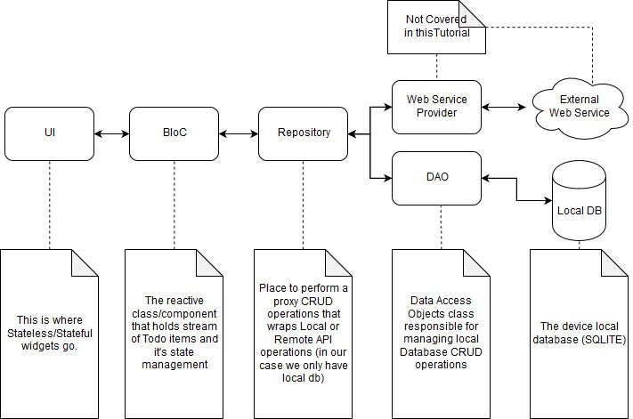

# Flutter 聊天 APP

## [如何开始 Flutter](./Flutter.md)

## 项目结构



通讯协议基于 `websocket` 和 `protobuf`;
用户界面基于 `flutter`，状态管理使用 [`flutter_bloc`](https://github.com/felangel/bloc/);
聊天逻辑使用传统的订阅发布模式；

应用三层结构，核心协议层，可分为：

- 协议，在 `protocol` 文件夹, 这里面是供上层调用，么有什么业务逻辑
- 业务逻辑，在 `blocs`|`chat_hub`文件夹，
- 界面交互层：界面展示/用户交互；`pages`|`widgets` 文件夹

### Plans

- [x] protocol
- [x] protobuf
- [ ] chatkit
- [ ] what else?

### 常用命令

#### proto

基于 koi.proto` 生成 dart 文件， [安装相应工具](http://ddrv.cn/a/154163) | [protobuf dart 教程](https://developers.google.com/protocol-buffers/docs/darttutorial)

```sh
sh shell/proto.sh
```

`protocol/network/sig_mapper.dart` 和 `protocol/network/decode_protobuf.dart` 也是后端生成的。

#### 同步后端生成文件

注意：保证该项目上级目录 clone 了 koi 仓库

```sh
sh shell/sync_proto.sh
```

#### l10n

国际化文件 [教程](https://flutter.dev/docs/development/accessibility-and-localization/internationalization) [中文](https://www.jianshu.com/p/82c6656462b8)

```sh
sh shell/l10n.sh
```

```sh
sh shell/l10n_to_dart.sh
```

## 问题记录

- 安卓机选择图片会耗尽内存，闪退
- 图片上传必须压缩，否则列表展示会耗尽内存闪退
- flutter 很多自己的插件比较简单，无法满足需求，而且社区的有很多也没有

## vscode 插件

- dart
- bloc
- Awesome Flutter Snippets
- flutter
  